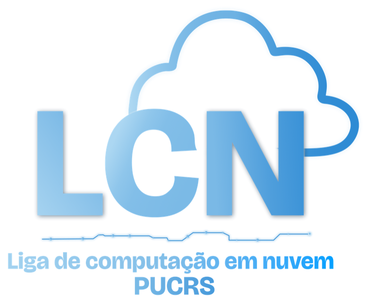

<div align="center">



# Landing Page · Liga de Computação em Nuvem — PUCRS

Site institucional da **Liga de Computação em Nuvem** da PUCRS (Escola Politécnica), vinculada ao programa **AWS Student Builder Group**.

[](https://react.dev/)
[](https://www.typescriptlang.org/)
[](https://vite.dev/)
[](https://tanstack.com/router)
[](https://tailwindcss.com/)

</div>

---

## ✨ Sobre

Landing page da comunidade, apresentando propósito, diretoria, calendário de encontros, catálogo de certificações, recursos de estudo e notícias do mundo cloud.

Identidade visual **"céu editorial"** — azul bebê + branco com texto navy, tipografia **Bricolage Grotesque + Inter + JetBrains Mono** e animações ricas (sempre respeitando `prefers-reduced-motion`).

## 🧱 Stack

- **React 19** + **TypeScript**
- **Vite 7** (build e dev server)
- **TanStack Router** (roteamento file-based) + **TanStack Query**
- **Tailwind CSS v4** + **tw-animate-css**
- **Framer Motion** (animações) · **Radix UI** + **lucide-react** + **react-icons** (UI/ícones)

## 🚀 Começando

```bash
npm install        # instala dependências
npm run dev        # servidor de desenvolvimento (gera o routeTree.gen.ts)
npm run build      # tsc -b && vite build (produção)
npm run preview    # serve o build de produção
npm run lint       # eslint
```

Requer **Node.js 20+**. O dev server sobe em `http://localhost:5173`.

## 📁 Estrutura

```
src/
├── routes/        # rotas file-based (wrappers finos → src/pages/)
├── pages/         # as 6 páginas: Home, Gestão, Recursos,
│                  #   Calendário, Certificações e Notícias
├── components/    # componentes por feature (home/, gestao/, ...) + ui/
├── data/          # ← fonte de conteúdo editável (dados tipados)
├── lib/           # utilitários (cn, brandLogos, ...)
└── index.css      # design tokens + classes de marca (.display, .accent-word, ...)

public/
├── Icones/        # logos oficiais da liga (LCN)
├── svg/           # ícones do AWS SBG (recoloridos via CSS em SbgIcon)
└── badges/        # badges oficiais das certificações (aws, azure, gcp)
```

## ✏️ Editando o conteúdo

Todo o conteúdo textual vive em `src/data/` como dados tipados — não é preciso mexer em componentes para atualizar o site:

| Conteúdo | Arquivo |
| --- | --- |
| Diretoria (nomes, cargos, bios, fotos) | `src/data/board.ts` |
| Recursos (plataformas/ferramentas) | `src/data/resources.ts` |
| Calendário (ciclos e encontros) | `src/data/calendar.ts` |
| Certificações (catálogo AWS/Azure/GCP) | `src/data/certifications.ts` |
| Notícias (curadoria de links) | `src/data/news.ts` |
| Redes sociais do rodapé | `src/data/social.ts` |

> Para adicionar a foto de um membro, coloque o arquivo em `public/gestao/` e defina `photo: '/gestao/nome.jpg'` no `board.ts`.

## 🌐 Comunidade

Participe pelo **[Meetup — AWS SBG PUCRS](https://www.meetup.com/aws-sbg-pucrs/)**.

<div align="center">
<br />
<sub>Feito com ☁️ pela Liga de Computação em Nuvem — PUCRS</sub>
</div>
